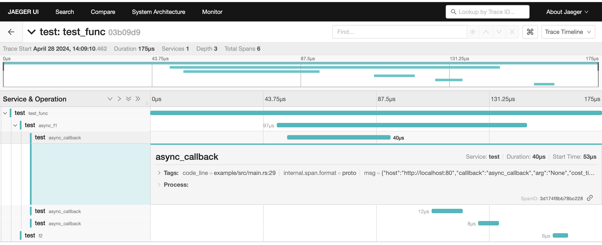

# rust_telemetry_tutorial

## 链路追踪


## 示例数据流

1. 使用[tracing](https://github.com/tokio-rs/tracing)规范化生成trace的span信息。 
2. 通过 subscriber 来处理和展示span信息。

## connecter


## 运行
默认执行路径为当前项目下
1. 运行测试环境
```shell
docker-compose up -d
...
```
2. 执行测试程序  
注:这里执行rust 程序需要切换到rust_telemetry_tutorial目录下
```shell
cd rust_telemetry_tutorial
cargo run src/main.rs
```
3. 执行结果  
访问jaeger地址: http://127.0.0.1:16686/


## exampl
rust 示例代码位于 rust_telemetry_tutorial/example/src 下 main.rs
```rust 
use trace_msg::{
    custom_span::{CustomContext, Interface},
    custom_tracer::{close_tracer, init_tracer, TracerConfig},
    new_span,
};

fn main() {
    // tracer 初始化默认使用Runtime::tokio, 进行批量发送
    let rt = tokio::runtime::Builder::new_multi_thread()
        .enable_all()
        .build()
        .unwrap();
    let multi_runtime = Arc::new(rt);

    // init tracer
    let trace_cfg = TracerConfig::default();
    init_tracer(trace_cfg, multi_runtime.clone());

    // 创建一个span (root)
    let span1 = new_span!("span_1");

    // 获取一个span的context，用来传递给其下游的span
    let span1_ctx = span.get_ctx();

    // 创建一个span,从指定的上游span_ctx 派生
    let span2 = new_span!("span_1", span1_ctx);

    // 为span添加属性字段,(key[&str], value[&struct<T: ?Sized + serde::Serialize>])
    #[derive(serde::Deserialize, serde::Serialize)]
    struct TestMsg {
        msg: String,
    }
    let test_msg = TestMsg {
        msg: String::from("msg"),
    };
    span2.set_custom_attribute("key", &test_msg);

    // 退出span
    span2.close();
    span1.close();

    // 关闭tracer
    close_tracer();
}
```

## 参考:  
[tracing](https://github.com/tokio-rs/tracing)  
[opentelemetry-collector](https://github.com/open-telemetry/opentelemetry-collector)  
[exampleconnector](https://github.com/gord02/exampleconnector)